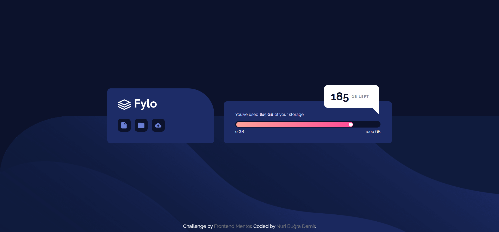

# Frontend Mentor - Fylo data storage component solution

### The challenge

Users should be able to:

- View the optimal layout for the site depending on their device's screen size

### Screenshot

### Links

- Solution URL: [Click to reach solution](https://enchanting-belekoy-3be9a3.netlify.app/)
- Live Site URL: [Click to reach live site](https://github.com/nuribugra/Frontend-Mentor-Challenges/tree/main/fylo-data-storage-component)

## My process

### Built with

- Semantic HTML5 markup
- CSS custom properties
- Flexbox
- Mobile-first workflow

## Author

- Frontend Mentor - [@nuribugra](https://www.frontendmentor.io/profile/nuribugra)
- Twitter - [@NuriBugraDemir](https://www.twitter.com/nuribugrademir)

